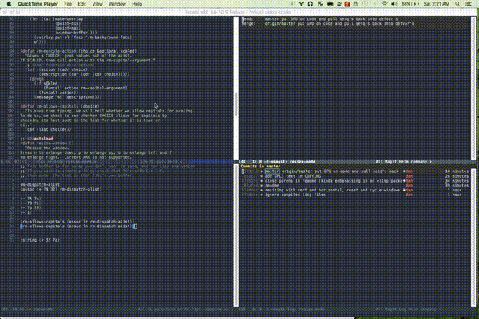

# Resize Mode #

[![License] (http://img.shields.io/:license-gpl3-blue.svg)](http://www.gnu.org/licenses/gpl-3.0.html)

## What it is ##
Resizing windows is a pain in emacs. You have to do an uncomfortable
chord `C-x {`, `C-x ^`. Giving prefixes to make the jump larger than 1
line means remembering `C-u <number> <terrible chord>`. I always
forget the number, making it difficult to do this. So this is a simple
minor mode to easily adjust window sizes with familiar keys and
without chords.

## How to use it ##
As soon as it gets polished a little further, it will hopefully be
accepted to ELPA or something (I'm not too sure about all of the
differences, ELPA, MELPA, marmalade, etc.

I've submitted for elpa and have a pending request to have copyright
assigned. Until then, just drop it into your load path. I've found the
following keybinding to be really nice:
`(global-set-key (kbd "C-c ;") 'resize-window)`.
This keeps your fingers on the home row, especially if you've remapped
the caps lock key to control.

But, just run `M-x resize-window`. There are only a few commands to learn,
and they mimic the normal motions in emacs.

- `n`: Makes the window vertically bigger, think scrolling down. Use
`N` to enlarge 5 lines at once.
- `p`: Makes the window vertically smaller, again, like scrolling. Use
`P` to shrink 5 lines at once.
- `f`: Makes the window horizontally bigger, like scrolling forward;
`F` for five lines at once.
- `b`: window horizontally smaller, `B` for five lines at once.
- `r`: reset window layout to standard
- `w`: cycle through windows so that you can adjust other window
panes. `W` cycles in the opposite direction.
- `?`: Display menu listing commands

The best part of this is that resize-window keeps listening for more
keystrokes until it doesn't recognize input. So you don't have to make
convulted chords to resize things two lines, or prefix a negative
number because you can't guess how far `C-u 17 C-x ^` will adjust your
view right away. Just invoke resize-window and just press your normal
motions and cycle windows until everything is adjusted to how you like
it.

## How to extend it ##
There are a few things that you can do. There are customizable variables:
- rw-capital-argument (default: 5)
- rw-default-argument (default: 1)
- rw-alow-backgrounds (default: t)

Any of these can be customized by using `customize-group RET
resize-window` or by setting the appropriate variable in your init.el
file as normal: `(setq <var> <val>)`.

Further, there are alias, held in the `rw-alias-list` alist. It is
currently defined as

    (defvar rw-alias-list
      '((right ?f)
        (up ?n)
        (left ?b)
        (down ?p))
      "List of aliases for commands.
    Rather than have to use n, etc, you can alias keys for others.")

However, you can easily add your own. For instance, to alias h to ?,
the help command, just add `(push '(?h ??) rw-alias-list)` in your init.el.

## Bugs ##
- When in resize mode, there's a visual overlay over the current
buffer to give some visual indication what's going on. However, if
you have two copies of the same buffer open, both are
overlayed. Would like to reduce this so that only the buffer you're
working in is overlaid, regardless of how many copies are open

## Hopeful upcoming features ##
I can't promise any of these but these are the things I'm hoping to
do:
- put overlays over *other* buffers rather than current one. This
greys out other workspaces and leaves yours with full color,
bringing your eye there. Just seems like a nice ergonomic touch.
- make into a true minor mode. Right now, its kinda straddling a minor
mode and just a function. In fact, i'm not sure that it needs to be
a minor mode, just needs to have a nice keybinding. But the things
that are calling my name for it being a minor mode are easily
customized variables, etc
- allow customization to invert capital/non-capital behavior. Right
now, lower case selections move the window size by 1 and upper-case
moves by 5. These should both be easy to customize and easy to
*flip*. Ie, make the lowercase `n` make it bigger by 5 and the
upper-case `N` increase by 1.

## Shout out ##
This is my first attempt at really doing anything in elisp and to get
there, I drew lots of inspiration and organizational ideas and almost
verbatim code from `ace-mode`. Ace mode is super super nice and my aim
is to make this more or less an ace mode for resizing windows rather
than jumping. In fact, this might actually be better as a pull request
to their package.

## How it works ##
Super simple architecture. There's an associative list called
`rm-dispatch-alist` (the rm is prefix for resize-mode) that holds a
simple data structure with the invocation-key, the function to call,
documentation string to be shown as a message, and whether it should
accept a capital letter as well as the lower-case letter.

The function `resize-window` is just a while loop listening for
characters, checking if that character is associated to anything in
the list and checking if `(+ char 32)` is associated to anything in
the list (which is just the uppercase version (or is it? now its a
bug)). If lower case matches, do it, if uppercase matches something,
then make sure that's ok and do it but with the `rm-capital-argument`
rather than `rm-default-argument`.
